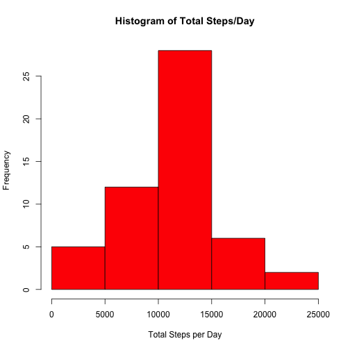
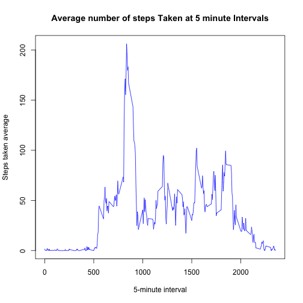
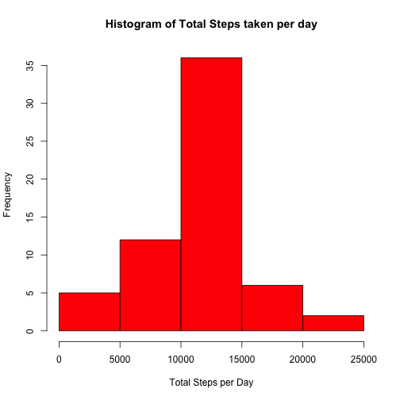

# Reproducible Research: Assignment 1
Loading Lattice data visualization system

```r
library(lattice)
```

## Loading and preprocessing the data
Loading Activity csv data **activity.csv** and date conversion to **R Date class**  

```r
activitydata <- read.csv(unzip("activity.zip"))
activitydata$date <- as.Date(activitydata$date,"%Y-%m-%d")
```

## What is mean total number of steps taken per day?
1. Make a histogram of the total number of steps taken each day
2. Calculate and report the mean and median total number of steps taken per day


Total number of steps per day  

```r
totalsteps <- tapply(activitydata$steps, activitydata$date,sum)
```
Plot histogram of **total number of steps/day**

```r
hist(totalsteps,col="red",xlab="Total Steps per Day", 
      ylab="Frequency", main="Histogram of Total Steps/Day")
```

 
Calculate Mean total **steps/day**

```r
mean(totalsteps,na.rm=TRUE)
```

```
## [1] 10766.19
```

Calculate Median total **steps/day**

```r
median(totalsteps,na.rm=TRUE)
```

```
## [1] 10765
```

## What is the average daily activity pattern?
1. Make a time series plot of the 5-minute interval (x-axis) and the average number of steps taken, averaged across all days (y-axis)
2. Calculate which 5-minute interval, on average across all the days in the dataset, contains the maximum number of steps


Calculate Mean of steps across all days by time interval

```r
meansteps <- tapply(activitydata$steps,activitydata$interval,
                                 mean,na.rm=TRUE)
```
Time series plot

```r
plot(row.names(meansteps),meansteps,type="l",
     xlab="5-minute interval", 
     ylab="Steps taken average", 
     main="Average number of steps Taken at 5 minute Intervals",
     col="blue")
```

 
Maximum average number of steps across all days by time interval

```r
interval_number <- which.max(meansteps)
interval_max <- names(interval_number)
interval_max
```

```
## [1] "835"
```


## Imputing missing values

1. Calculate and report the total number of missing values in the dataset.
2. Devise a strategy for filling in all of the missing values in the dataset.
3. Create a new dataset that is equal to the original dataset but with the missing data filled in.
4. Make a histogram of the total number of steps taken each day and Calculate and report the mean and median total number of steps taken per day. 


Calculate the total of NA values in the original dataset

```r
total_NA <- sum(is.na(activitydata))
total_NA 
```

```
## [1] 2304
```

Filling in all of the missing values with the **average interval value across all days**

```r
na_index <-  which(is.na(activitydata))
activity_imputed <- meansteps[as.character(activitydata[na_index,3])]
names(activity_imputed) <- na_index
for (i in na_index) {
    activitydata$steps[i] = activity_imputed[as.character(i)]
}
sum(is.na(activitydata)) 
```

```
## [1] 0
```

```r
totalsteps <- tapply(activitydata$steps, activitydata$date,sum)
hist(totalsteps,col="red",xlab="Total Steps per Day", 
      ylab="Frequency", main="Histogram of Total Steps taken per day")
```

 


## Are there differences in activity patterns between weekdays and weekends?
1. Create a new factor variable in the dataset with two levels – “weekday” and “weekend” indicating whether a given date is a weekday or weekend day.
2. Make a panel plot containing a time series plot (i.e. type = "l") of the 5-minute interval (x-axis) and the average number of steps taken, averaged across all weekday days or weekend days (y-axis).


```r
days <- weekdays(activitydata$date)
activitydata$day_type <- ifelse(days == "Saturday" | days == "Sunday", 
                                "Weekend", "Weekday")
meansteps <- aggregate(activitydata$steps,
                                    by=list(activitydata$interval,
                                            activitydata$day_type),mean)
names(meansteps) <- c("interval","day_type","steps")
xyplot(steps~interval | day_type, meansteps,type="l",
       layout=c(1,2),xlab="Interval",ylab = "Number of steps")
```

 
Computing the mean, median, max and min of the steps across all intervals and Weekdays/Weekends

```r
tapply(meansteps$steps,meansteps$day_type,
       function (x) { c(MINIMUM=min(x),MEAN=mean(x),
                        MEDIAN=median(x),MAXIMUM=max(x))})
```

```
## $Weekday
##   MINIMUM      MEAN    MEDIAN   MAXIMUM 
##   0.00000  35.61058  25.80314 230.37820 
## 
## $Weekend
##   MINIMUM      MEAN    MEDIAN   MAXIMUM 
##   0.00000  42.36640  32.33962 166.63915
```
The end!
